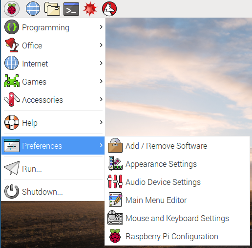
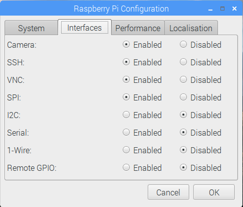
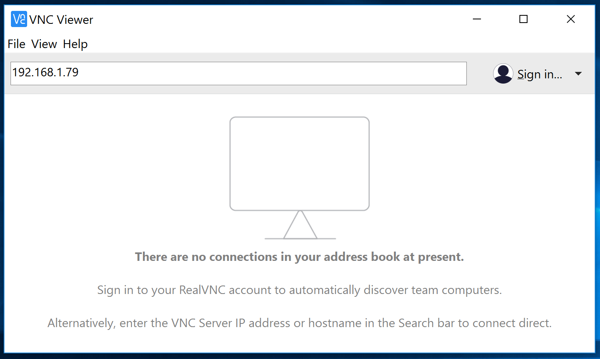
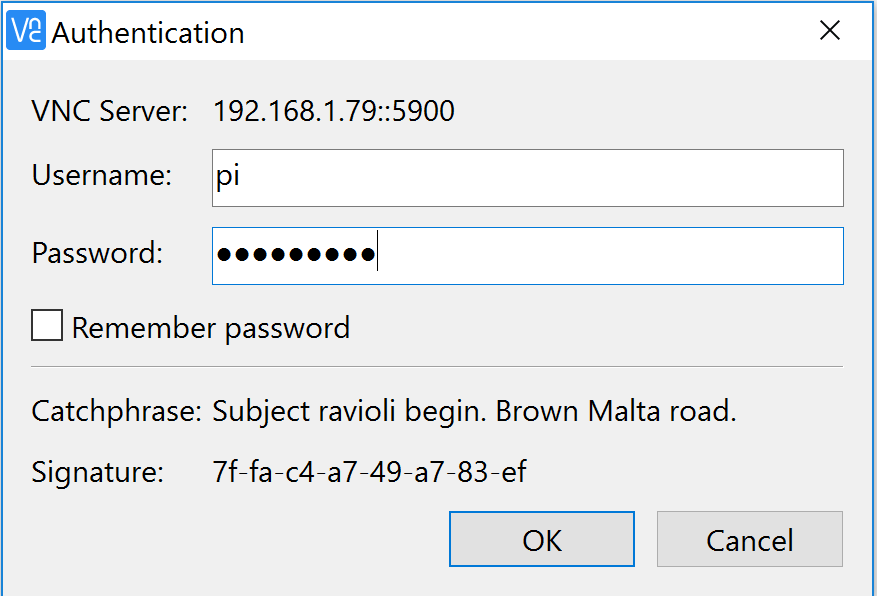
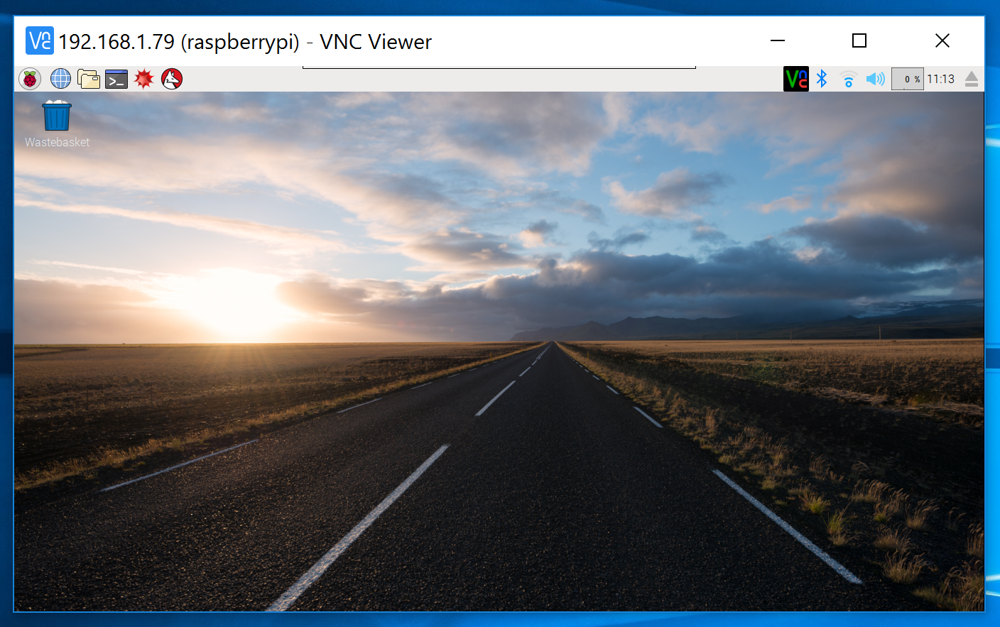
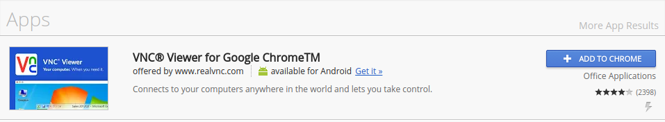
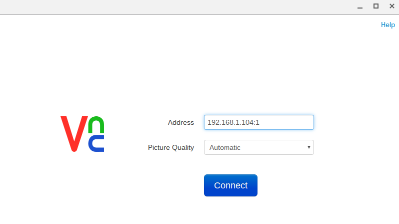
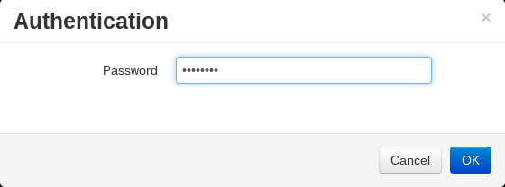
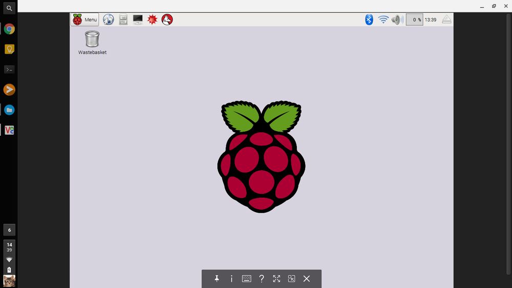

As long as your Raspberry Pi is networked, either via WiFi or Ethernet, you can operate it remotely from any existing networked computer.

Virtual Network Computing (VNC) is a protocol that allows you to control one computer from another computer. The advantage of using VNC is that you gain access to the full desktop of the Raspberry Pi, meaning you can use graphical programs from the connected computer.

- The first thing to do is to enable the VNC server on the Raspberry Pi. Raspbian comes pre-installed with [RealVNC](https://www.realvnc.com/){:target="_blank"}.

- Click on `Menu`>`Preferences`>`Raspberry Pi Configuration`.

- Then you need to enable the VNC Server by clicking the `Enabled` Radio button.

You should see the icon for the VNC Server in your menu bar.

Your VNC Server will now start whenever the Pi is booted, and will continue to do so until you disable the VNC Server again.

To connect to the Raspberry Pi from another computer, you can follow the instructions in one of the links below:

### Connecting  with Windows, Linux and Mac OS

There are many VNC viewers that can be downloaded and used with your main desktop computer. For simplicity's sake, the instructions below are for using RealVNC.

- Download the client for your preferred operating system from the [RealVNC](https://www.realvnc.com/download/viewer){:target="_blank"} website.
- Install the downloaded software.
- When you run the software for the first time, you will be asked to accept the terms and conditions.
- You can now connect remotely to your Raspberry Pi by typing its IP address into the connection bar. If you don't know the IP address of your Raspberry Pi, you can find it by clicking on the RealVNC icon on the Raspberry Pi's desktop.

  

- Next, you'll be asked to authenticate. Type in your Raspberry Pi username and password (the default is `pi` and `raspberry`).

  

- You should now have a remote desktop session.

  

### VNC with Chrome OS

You'll need an app from the Chrome Web Store to use VNC on a Chromebook.

- In the Chrome Web Store, search for 'VNC Viewer for Google Chrome' and add the application to Chrome:

  

- With the app open, you can type in the IP address and desktop number for the Raspberry Pi:

  

- Enter the password at the prompt:

  

- You should now be connected to the Raspberry Pi:

### Other platforms
Most mobile platforms (Android, iOS, Windows Mobile) have their own VNC apps available in their respective app-stores that you can also use.
